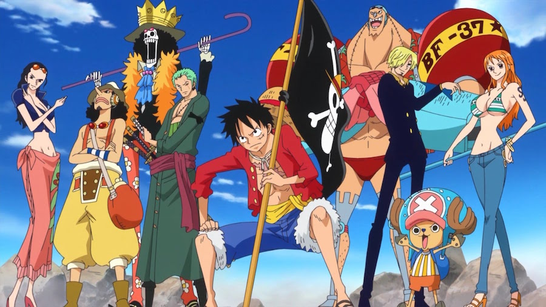

# Portada🏴‍☠️

## Autor😄
**_Antonio  Jesus Luque Bolivar_**
# Descripción
Archivos Html y xml de ejercicios realizados en lenguaje de marcas
## Descripcion de las etiquetas utilizadas
>### Etiquetas para la imagen:
- Hemos usado la siguiente etiqueta -
>### Etiquetas para las letras
- Hemos usado el -#- para los titulos de cada sección.
- Las etiquetas del doble asterisco para la letra en negrita (** Texto **)
- Las etiquetas de la barra abajo para la letra en cursiva (_ Texto _)

